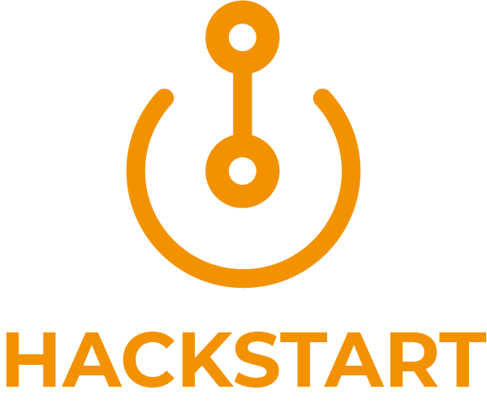

 

  

 

HackStart website

## Features

- Full static
- Pure HTML, CSS and JavaScript
- Easy customization
- Deployed in GitHub Pages

## Run project

Needs: Nothing

### Local 

1. Clone repository to your computer with `git clone https://github.com/hackupc/hackstart`
2. `cd` into your repository
3. Open `index.html`

### Deploy

1. Push changes to master
2. There's no `2`

Deployment is done automatically by [GitHub pages](https://pages.github.com/). You don't need to do anything else than pushing to master.

## License

MIT © Hackers at UPC
